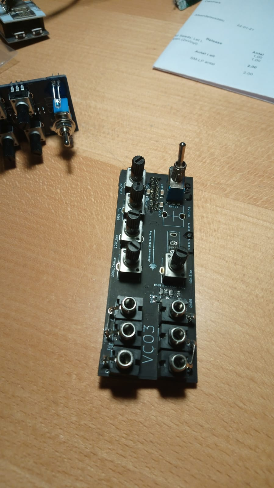
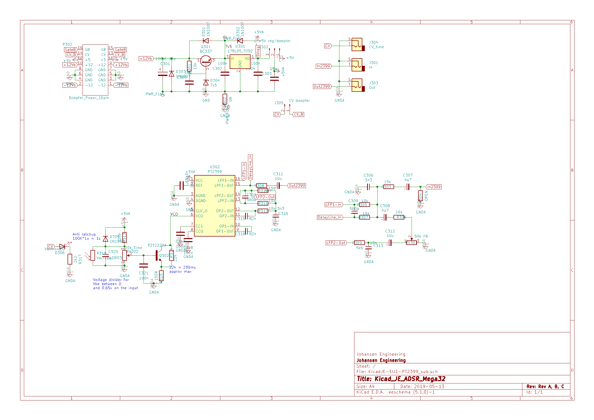

# KicadJE_ADSR_Mega32
Initial ATMega32 board (EU-5 ADSR32)

Second PT2399 reverb (EU-4 Reverb)

Third VCO - based on Format VCO (VCO3)

# Purpose
1 - try out ATMega 32 for digital applications with more IO

2 - PT2399 2nd revision

3 - Formant VCO modification 3rd rev

# Status - delivered
## Initial 
| Stage  | Detail | Status |
| ------------- | ------------- | ------------- |
| create material  | sch/pcb | OK  |
| | gerber | OK |
| production  |   | OK |
|  | produced | OK |
|  | delivered | OK |

## Preliminary validation
| Test  | Detail | Status |
| ------------- | ------------- | ------------- |
| Initial Inspection | | OK |
| Initial Technical Test | ADSR | ICSP:ok - Serial: no success - LED: OK - POT:no success|
| Initial Technical Test | Reverb | OK |
| Initial Technical Test | VCO3 | OK |
| Initial Product Test | ADSR | ADC not working due to GND conn to Aref |
| Initial Product Test | Reverb | Works nicely (tested with 5V from 16pin Doepfer|
| Initial Product Test | VCO3 | Working - output and "sine" - Square not working - UMX1 works nicely as CV - FM works - LFO works - POT's reversed... |

## Secondary validation
| Test  | Detail | Status |
| ------------- | ------------- |------------- |
| Product Test |  | |
| Product Test |  |  |
| Quality | | |
| Quality | VCO3 | Range from 20Hz |
| Long Term Product Test |  |  |
| Power Draw |  | 
| Power Draw |  | 
| Power Draw | VCO3 | +5V 1mA, +12V 7mA, -12V 6mA 

## Errata
### Errata - VCO3
1 - ALL pots are reversed
### Errata - ADSR Mega32
1 - ADC not working due to GND conn to Aref

## Issues and Notes
### VCO 3
1 - C104 needs to be bigger (tried w 20uf that worked nicely)

2 - Square circuit not working

3 - Unsure of trigger feature

4 - ALL pots are reversed

5 - Consider adding LED

# Pictures

## VCO3

## Reverb

# Inspiration from 
https://github.com/promesoft/KicadJE_EffectsUnit1

https://github.com/promesoft/ArduinoJE_ADSR

https://github.com/promesoft/KicadFormantVCO
