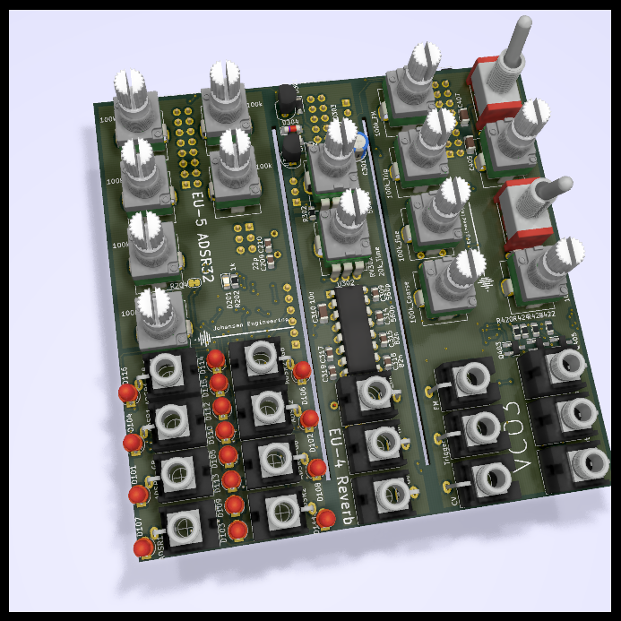
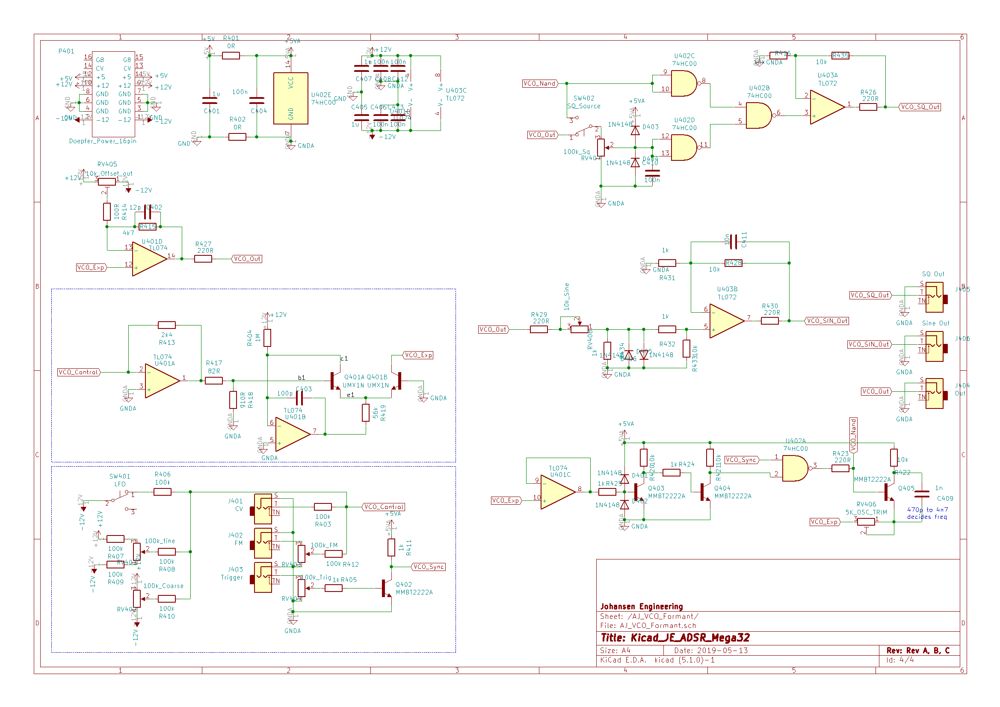

# KicadJE_ADSR_Mega32
Initial ATMega32 board (EU-5 ADSR32)

Second PT2399 reverb (EU-4 Reverb)

Third VCO - based on Format VCO (VCO3)

# Purpose
1 - try out ATMega 32 for digital applications with more IO

2 - PT2399 2nd revision

3 - Formant VCO modification 3rd rev

# Status - delivered
## Initial 
| Stage  | Detail | Status |
| ------------- | ------------- | ------------- |
| create material  | sch/pcb | OK  |
| | gerber | OK |
| production  |   | OK |
|  | produced | OK |
|  | delivered | OK |

## Preliminary validation
| Test  | Detail | Status |
| ------------- | ------------- | ------------- |
| Initial Inspection | |  |
| Initial Technical Test |  |  |
| Initial Product Test | ADSR |  |
| Initial Product Test | Reverb |  |
| Initial Product Test | VCO3 |  |

## Secondary validation
| Test  | Detail | Status |
| ------------- | ------------- |------------- |
| Product Test |  | |
| Product Test |  |  |
| Quality | | |
| Quality | | |
| Long Term Product Test |  |  |
| Power Draw |  | 

## Errata
### Errata -

## Issues and Notes
### 

# Pictures

## VCO3

# Inspiration from 
https://github.com/promesoft/KicadJE_EffectsUnit1

https://github.com/promesoft/ArduinoJE_ADSR

https://github.com/promesoft/KicadFormantVCO
